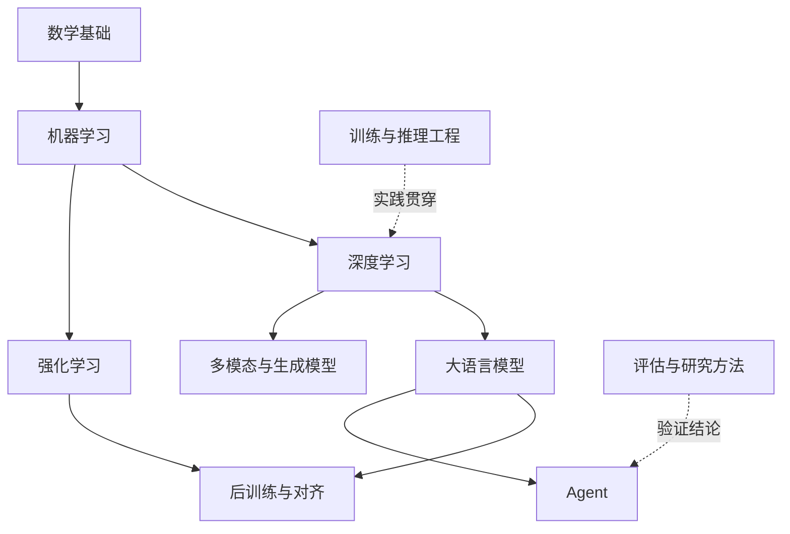

# 学习路线与方法

[返回首页](../README.md)

## 路线

已有编程或数学基础时，可以从深度学习、大模型或 Agent 入手，遇到缺口再回到基础目录补齐。RL 路线先理解 MDP、价值函数和 Bellman 方程，再进入策略梯度与 PPO。

## 每日学习流程

| 步骤 | 产出 | 判断标准 |
| --- | --- | --- |
| 定题 | 一个具体问题 | 范围能用一篇笔记解释清楚 |
| 搜集 | 2–4 个来源 | 至少一个一手来源，记录访问日期 |
| 理解 | 定义、推导、例子 | 符号和假设明确，可用自己的话复述 |
| 图解 | 一张机制图 | 能解释数据流、依赖或决策过程 |
| 实践 | 一个最小验证 | 记录环境、输入、结果与局限 |
| 归纳 | Markdown 文档 | 有结论、误区和扩展阅读 |
| 复习 | 2–3 个自测问题 | 闭卷解释，再对照资料纠错 |

建议在第 1、7、30 天复习，根据理解程度调整间隔。复习日期和真实结论填写到学习日志。

## 首轮学习建议

1. 梯度与链式法则 → 反向传播 → 最小训练循环。
2. Tokenization → Embedding → 自注意力 → Transformer → 自回归生成。
3. MDP → Bellman 方程 → Q-Learning → Policy Gradient → PPO。
4. 工具调用 → ReAct → RAG → 停止条件与失败恢复 → 任务评估。
5. 连接 SFT、偏好学习与 RLHF，并比较各自的数据、目标函数和评估方式。

每次只展开一个小知识点，保持笔记可复习、可交叉链接、可验证。
