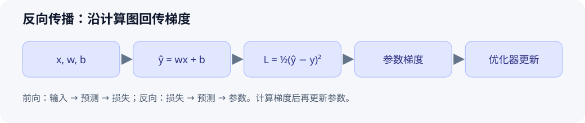

# 反向传播与自动微分

> 初始示范：原理与手算示例已整理；个人实验和复习待完成。

[返回主题索引](README.md) · [返回首页](../README.md)

[完整解说视频（约 4 分钟）](https://qingjian-shikanon-media-sg-2026.oss-ap-southeast-1.aliyuncs.com/my-deep-learning-journey/knowledge-videos/backpropagation/6b8d998cb3835256/backpropagation-v2.mp4) · [分镜与制作工程](backpropagation/video/README.md)


## 核心问题与结论

如何计算每个参数对损失的影响？反向传播把复合函数拆成计算图，从输出向输入按链式法则传递梯度。计算梯度后，优化器才利用它更新参数。

## 前置知识

导数、偏导数、链式法则、计算图。先掌握标量例子，再扩展到矩阵和张量。

## 原理与推导

设单个样本的预测为 $\hat y=wx+b$，损失为 $L=\frac12(\hat y-y)^2$。链式法则给出：

$$
\frac{\partial L}{\partial w}=(\hat y-y)x,\qquad
\frac{\partial L}{\partial b}=\hat y-y.
$$

这里 $x,y$ 是输入和目标，$w,b$ 是可训练参数。设 $x=2,y=5,w=1,b=0$，则预测为 2，损失为 4.5，两个梯度分别为 -6 与 -3。学习率取 0.1，执行一次梯度下降后，$w=1.6,b=0.3$；预测为 3.5，损失降为 1.125。这是手算结果。

一般计算图中，一个变量若影响多条下游路径，需要把各路径传回的梯度相加。

## 图解



图注：原创示意。上方沿输入到损失计算数值，下方沿损失到参数传播梯度；参数更新发生在梯度计算之后。

## 最小例子与实践

无需第三方库的验证代码：

```python
x, y, w, b = 2.0, 5.0, 1.0, 0.0
def loss(w, b):
    return 0.5 * (w * x + b - y) ** 2
eps = 1e-5
analytic = (w * x + b - y) * x
numeric = (loss(w + eps, b) - loss(w - eps, b)) / (2 * eps)
print(analytic, numeric)  # 预期均约为 -6
```

- 环境：Python 3，记录实际版本；无随机性。
- 验证目标：解析梯度与中心差分近似一致。
- 个人实测：待执行。
- 扩展练习：在已有 PyTorch 环境中比较 `loss.backward()` 后的 `.grad`；重复反传前清空累计梯度。

## 常见误区与适用边界

| 误区 | 正确理解 |
| --- | --- |
| 反向传播自动更新参数 | 它计算梯度；更新由优化步骤执行 |
| 负梯度意味着参数要减少 | 梯度下降减去梯度；负梯度使该参数增加 |
| 数值差分可以替代大模型训练中的反传 | 数值差分适合小规模梯度检查，逐参数计算代价很高 |

## 论文与扩展阅读

| 来源 | 年份 | 阅读位置与目的 | 阅读状态 / 访问核验 |
| --- | --- | --- | --- |
| [Learning representations by back-propagating errors](https://www.nature.com/articles/323533a0) | 1986 | 理解误差如何逐层传递 | 待读 / 页面已核验，全文需访问权限 |
| [Deep Learning](https://www.deeplearningbook.org/) | 2016 | 第 6 章，前馈网络与反向传播 | 待读 / 首页已核验 |
| [PyTorch Autograd 教程](https://docs.pytorch.org/tutorials/beginner/blitz/autograd_tutorial.html) | 持续更新 | 对照自动微分与梯度累计行为 | 待读 / 页面已核验 |

参考链接核验日期：2026-10-01。

## 个人归纳与待解问题

- 待补充：用自己的话解释为什么多条路径的梯度需要相加。
- 下一篇：梯度消失、初始化或优化器。

## 自测与复习

- [ ] 不看答案，手算上述例子的参数梯度。
- [ ] 写出两条下游路径的梯度相加例子。
- [ ] 解释学习率过大时，为什么一步更新可能增加损失。
- 下次复习：个人学习后填写。
