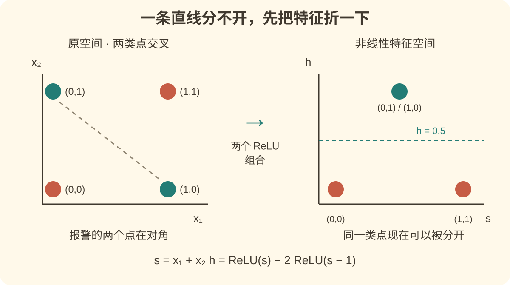
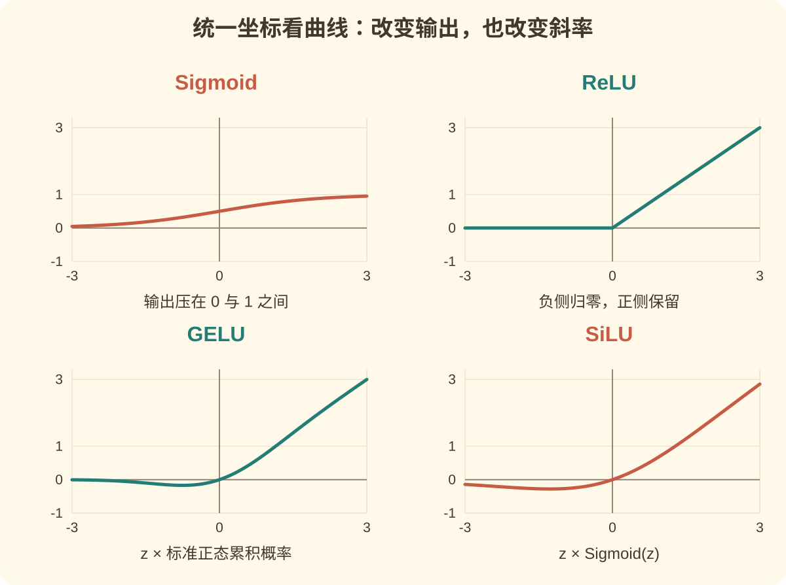
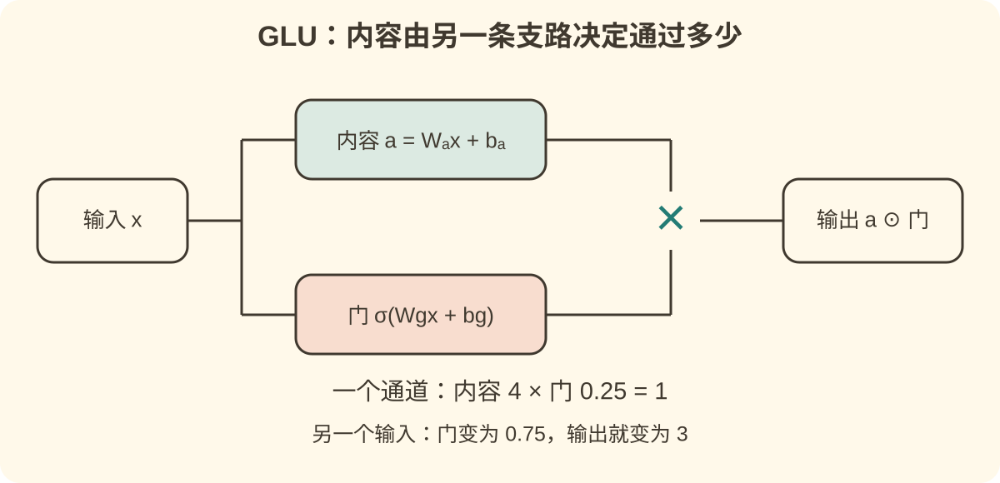

# 激活函数：为什么一百层网络，可能还不如一个拐弯？

[返回知识点索引](README.md) · [返回总索引](../../README.md) · [配套竖屏解说与工程](video/README.md)

[](video/README.md)

<!-- narrative:motivation:start -->

## 一句话认识这个概念

**激活函数把神经元算出的分数，再做一次有选择的变换，让网络能够表示复杂关系，也影响它能否顺利学习。**

想象一个模型只会“乘一个数，再加一个数”。你让它重复一百次，它仍然只是这两件事的组合。激活函数提供的“拐弯”，才让不同输入走出不同的计算路径。后来，这个拐弯又演化成可调节的音量旋钮，以及由输入自己控制的信息闸门。

本文沿着三个问题展开：为什么需要非线性；怎样让非线性不妨碍训练；大模型时代怎样兼顾表达能力、稳定性与计算成本。读完后，你应该能解释公式里的每一次变化，而不只是记住几个英文缩写。

## 为什么被提出，要解决什么问题

### 一个四行数据就能暴露的问题

两盏灯，各有“开”和“关”两种状态。只有恰好一盏灯亮时，报警器才响。这就是**异或（XOR）**：

| 灯一 $x_1$ | 灯二 $x_2$ | 报警 $y$ |
| --- | --- | --- |
| 0 | 0 | 0 |
| 0 | 1 | 1 |
| 1 | 0 | 1 |
| 1 | 1 | 0 |

把四种情况画在平面上，报警的两个点处于对角，不报警的两个点处于另一个对角。**一条直线无法把两类点分开。**

这里的障碍不是数据少、训练久不久，而是模型能表达的关系不够。对于线性打分 $s=ax_1+bx_2+c$，设“大于零就报警”，四行要求分别是 $c\leq0$、$b+c>0$、$a+c>0$、$a+b+c\leq0$。中间两项相加得到 $a+b+2c>0$，再结合 $c\leq0$，推出 $a+b+c>0$，与最后一项矛盾。改用别的固定阈值，只是把阈值吸收到 $c$ 里，障碍仍在。



图中变换后的横轴是 $s=x_1+x_2$，纵轴是 $h=\max(0,s)-2\max(0,s-1)$。四个输入得到 $h=0,1,1,0$；水平线 $h=0.5$ 就能分开两类。两个 $h=1$ 的点重合，图上标注了两个输入。

### 为什么多加几层也救不了纯线性网络

一层通常先做加权求和：

$$z=Wx+b.$$

把输入向量 $x$ 想成原材料，权重矩阵 $W$ 决定如何混合，偏置 $b$ 决定整体向哪边挪。严格地说，带偏置的变换叫**仿射变换**；深度学习中也常把它简称为“线性层”。

假如下一层仍然只做这种变换：

$$W_2(W_1x+b_1)+b_2=(W_2W_1)x+(W_2b_1+b_2).$$

右边还是一个新的线性层。层数增加可能改变参数化方式和优化过程，但不能突破这个函数形式。经过一个线性分数的单调输出函数再设阈值，分类边界也仍是直线或高维超平面。

在两层之间加入非线性的 $\phi$：

$$h=\phi(W_1x+b_1),\qquad y=W_2h+b_2,$$

就不能通常把它合并成同一个仿射变换了。模型可以先识别“至少一盏亮”和“两盏都亮”，再组合出“恰好一盏亮”。**非线性让网络能够创造有用的中间特征。**它提供表达能力；权重怎么学好，还需要损失函数与优化算法。

### 从“能表示”到“能学会”，还有第二道关

一个激活函数即使能表示复杂关系，也可能让训练很困难。

训练时，模型先预测，再用损失衡量错误，最后把“应该怎样修改”的信号逐层传回去。这个过程叫反向传播。每经过一个激活函数，信号都会乘上它的局部斜率，也就是导数。若一连串斜率都很小，前面的层收到的信号就可能越来越弱。

只看激活函数这一因素，十次相乘 $0.25$，结果是 $0.25^{10}\approx9.54\times10^{-7}$。这只是说明机制的算例，真实梯度还包含权重矩阵、残差路径等，不能据此断言所有网络必然按这个速度衰减。

激活函数的设计因此有两个经常拉扯的目标：让函数足够丰富；让学习信号能够传过去。到了大模型，又加上第三个目标：让这些计算在有限精度、有限显存和真实硬件上可承受。

## 前置知识与关联概念

只需要先接受三个概念：向量是一组数；导数是“输入稍变时，输出改变得有多快”；梯度把这个变化方向推广到一组参数。

- [多层感知机与前馈网络](../mlp-and-ffn/README.md)：看清线性层、隐藏层与输出层各做什么。
- [反向传播](../backpropagation/README.md)：理解学习信号为什么涉及导数连乘。
- [损失函数](../loss-functions/README.md)：规定答案错在哪里，和激活函数承担不同任务。
- [归一化](../normalization/README.md)：控制数值分布，会与激活函数的饱和区、量级相互影响。

## 直觉、图解与核心原理

对普通逐元素激活，一层可以写成 $h_i=\phi(z_i)$。$z_i$ 是第 $i$ 个神经元的分数，$h_i$ 是输出。这里的“激活”未必意味着开关：输出可以是零、负数或大于一的数。

局部反向传播写成：

$$\frac{\partial L}{\partial z_i}=\frac{\partial L}{\partial h_i}\,\phi'(z_i).$$

$L$ 是损失。右边第一项是下一层传来的信号，第二项是本层激活函数的局部斜率。**正向看曲线怎样变换输入，反向看斜率怎样传递信号**，就能理解下面绝大多数演化。



四幅图使用同一坐标范围。Sigmoid 把数值压进 0 到 1；ReLU 截掉负半轴；GELU 与 SiLU 在零附近平滑过渡，并保留一小段负输出。图中没有把每条曲线各自缩放成一样高，以免误导比较。

<!-- narrative:motivation:end -->
<!-- narrative:evolution:start -->

## 历史演进

### 第一轮：从阈值开关，到可微的连续曲线

1943 年，Warren McCulloch 与 Walter Pitts 用阈值神经元讨论逻辑计算；1958 年，Frank Rosenblatt 的感知机研究把学习规则与分类联系起来。这些是人工神经元的重要历史起点，不代表现代激活函数由某一个人一次性发明。[McCulloch–Pitts 原文](https://doi.org/10.1007/BF02478259)、[Rosenblatt 原文](https://doi.org/10.1037/h0042519)。

硬阈值很直观：分数够高就输出一，否则输出零。但它几乎处处导数为零，在跳变点又不可导。直接使用普通梯度下降，难以根据“差一点就跨过阈值”得到有效调整；感知机的学习规则本身也不等同于对硬阈值做普通反向传播。

平滑的 S 形曲线提供了另一种选择：

$$\sigma(z)=\frac{1}{1+e^{-z}},\qquad
\sigma'(z)=\sigma(z)(1-\sigma(z)).$$

Sigmoid 的输出在 $(0,1)$ 内，像一个连续的开关。它的梯度可以计算，输出也便于解释成二分类模型里的概率；但隐藏层每个 Sigmoid 的值并不自动成为某件事的校准概率。

1986 年，David Rumelhart、Geoffrey Hinton 与 Ronald Williams 的论文展示了通过反向传播学习隐藏表征的关键做法。它是推广多层网络训练的重要转折，不能把它写成反向传播思想唯一或最早的来源。[原文](https://doi.org/10.1038/323533a0)。

问题随深度暴露：Sigmoid 在很正或很负的地方接近水平，称为**饱和**。它的导数最大也只有 $1/4$。一个神经元已经“很肯定”时，即使判断方向错了，传给早期层的调整信号也可能很弱。

Tanh 把输出改为围绕零分布：

$$\tanh(z)=\frac{e^z-e^{-z}}{e^z+e^{-z}}
=2\sigma(2z)-1,\qquad
\tanh'(z)=1-\tanh^2(z).$$

它的输出在 $(-1,1)$，零附近斜率为一；相较非负的 Sigmoid，更容易得到有正有负的隐藏信号。**零中心解决了一个数值特征，饱和却仍然存在。**Tanh 没有因此消灭梯度消失。Bengio、Simard 与 Frasconi 在 1994 年研究了循环网络长期依赖中的梯度困难；那是时间展开的场景，不能把论文范围直接改写成所有前馈网络的定理。[原文](https://doi.org/10.1109/72.279181)。

### 第二轮：不把正数压扁——ReLU 的取舍

整流线性单元（ReLU）采用：

$$\operatorname{ReLU}(z)=\max(0,z).$$

这次变化看似更简单：负数变成零，正数原样通过。它在正半轴的导数是一，没有 Sigmoid 那样的正向饱和；大量零输出又带来**稀疏激活**，即一次输入只有部分神经元输出非零。

例如输入 $-2,-1,0,1,2$，输出就是 $0,0,0,1,2$。零点的折角不会让整个方法失效，自动微分框架可以约定那里使用的梯度值；“处处光滑”并非普通深度学习的必要条件。

整流思想有更早来源。Vinod Nair 与 Hinton 在 2010 年研究它在受限玻尔兹曼机中的效果；Glorot、Bordes 与 Bengio 在 2011 年展示深层整流网络及其稀疏表征；2012 年 AlexNet 又让这种激活在大规模视觉应用中受到广泛关注。它们分别是重要研究、深层训练证据和应用突破，不能合并成“2012 年发明 ReLU”。[2010 论文](https://www.cs.toronto.edu/~hinton/absps/reluICML.pdf)、[2011 论文](https://proceedings.mlr.press/v15/glorot11a.html)、[AlexNet](https://proceedings.neurips.cc/paper/2012/hash/c399862d3b9d6b76c8436e924a68c45b-Abstract.html)。

代价也来自同一个公式：负半轴导数为零。若某个单元对训练数据始终落在那里，通过这条路径的梯度就可能一直为零，俗称**死亡 ReLU**。这不是“负数本来没用”，而是我们主动做的取舍。

于是出现了几种修补：

修补不会取消整个取舍。留一点负侧斜率，可以避免完全堵住这条学习路径，但激活也更密集了；让斜率可学习，适配能力增加了，结果又依赖数据与优化。比较一个函数时，至少应同时看正向输出、反向导数和计算代价，不能只凭曲线形状排出永久名次。

| 方法 | 公式或关键变化 | 想修补什么 | 新取舍 |
| --- | --- | --- | --- |
| Leaky ReLU | $\max(\alpha z,z)$，通常固定 $0<\alpha<1$ | 给负半轴留一点斜率 | 不再有同样多的精确零；斜率需要选择 |
| PReLU | $z\geq0$ 时为 $z$，否则为 $az$；$a$ 可学习 | 让负半轴斜率适应任务 | 增加少量参数；学到的斜率需结合训练看 |
| ELU | $z>0$ 时为 $z$，否则为 $\alpha(e^z-1)$ | 保留负输出，并在负侧平滑饱和 | 负侧仍可能饱和；指数计算有成本 |

Leaky ReLU 可参考 Maas、Hannun、Ng 的 [2013 年声学模型论文](https://ai.stanford.edu/~amaas/papers/relu_hybrid_icml2013_final.pdf)；PReLU 见何恺明等人的 [2015 年论文](https://arxiv.org/abs/1502.01852)；ELU 见 Clevert、Unterthiner、Hochreiter 的 [2015 年预印本](https://arxiv.org/abs/1511.07289)。

何恺明等人的论文还有一个与激活同样重要的贡献：针对整流网络推导初始化。直觉上，每层既会混合数值，又会截掉一部分，初始权重大小必须和这种变换配合。**换函数与换初始化，常常需要一起考虑**，不能只把一次性能提升归因于曲线的名字。

### 第三轮：从一刀切，到平滑地按输入加权

ReLU 的负半轴全归零。能否让零附近的小信号柔和地通过，同时让大正数继续接近原值？

Dan Hendrycks 与 Kevin Gimpel 在 2016 年提出高斯误差线性单元（GELU）：

$$\operatorname{GELU}(z)=z\Phi(z),\qquad
\Phi(z)=\Pr(Z\leq z),\quad Z\sim\mathcal N(0,1).$$

$\Phi$ 是标准正态分布的累积分布函数。可以把它看成一个随输入升高而增大的通过比例：大负数几乎不过，大正数几乎全过，零附近平滑过渡。概率分布用于构造这个权重，**普通 GELU 前向计算本身是确定性的**，并没有每次随机掷硬币。[GELU 原文](https://arxiv.org/abs/1606.08415)。

例如 $z=1$ 时，GELU 约为 $0.8413$；$z=-1$ 时约为 $-0.1587$。它保留了小幅负值，也在某段负区间出现非单调性。这些性质不能简单归结为“更光滑所以必然更好”；价值要通过具体训练配置验证。工程里也可能用近似公式，比较时需说明采用精确 $\Phi$ 还是近似。

另一个形式用 Sigmoid 做权重：

$$\operatorname{SiLU}(z)=z\sigma(z),\qquad
\operatorname{Swish}_{\beta}(z)=z\sigma(\beta z).$$

当 $\beta=1$ 时，两者是同一个函数。公式里的 Sigmoid 只负责调节“通过比例”，真正输出还乘着 $z$，所以 SiLU 的正向输出没有被压到一以下。其导数为

$$\operatorname{SiLU}'(z)=\sigma(z)+z\sigma(z)(1-\sigma(z)).$$

SiLU 已在 2016 年 GELU 工作中出现；Elfwing、Uchibe 与 Doya 在 2017 年研究它在强化学习中的应用；Ramachandran、Zoph 与 Le 的 2017 年自动搜索工作推广了 Swish 形式。这里应分别记住早期公式、后续研究场景与搜索/命名，避免把相同公式重复算作不同发明。[GELU 修订版历史附录](https://arxiv.org/html/1606.08415v5#A2)、[强化学习论文](https://arxiv.org/abs/1702.03118)、[搜索论文](https://arxiv.org/abs/1710.05941)。

### 第四轮：不只变换一个数，而是让两条支路相乘

前面的典型激活处理一个神经元的分数：$z\mapsto\phi(z)$。**门控**更进一步：从同一输入计算两组特征，一组提供内容，另一组决定内容怎样通过。

采用列向量约定，令输入 $x\in\mathbb R^d$，两条支路宽度为 $m$：

$$a=W_ax+b_a,\qquad g=W_gx+b_g,\qquad
\operatorname{GLU}(x)=a\odot\sigma(g).$$

$W_a,W_g\in\mathbb R^{m\times d}$；$\odot$ 表示对应位置相乘。若某个通道的内容为四，门为 $0.25$，结果是一；换一个输入，门为 $0.75$，结果是三。**通过多少由输入决定，并且门的计算拥有自己的权重。**这比仅对同一个 $z$ 乘 $\sigma(z)$ 多了一条独立投影。



图中的两个门值用于说明乘法机制，不来自同一个固定输入；实际门值由另一组权重计算。

Yann Dauphin、Angela Fan、Michael Auli、David Grangier 的门控卷积语言模型首次预印于 2016 年，正式发表于 ICML 2017。它把 GLU 用于语言建模，是门控进入这条演化主线的重要节点。[会议原文](https://proceedings.mlr.press/v70/dauphin17a.html)。

Noam Shazeer 在 2020 年把不同门函数放进 Transformer 的前馈网络（FFN），比较 GLU、GEGLU、SwiGLU 等形式。省略偏置时：

$$\operatorname{FFN}_{\mathrm{SwiGLU}}(x)
=W_o\big[(W_ax)\odot\operatorname{SiLU}(W_gx)\big],\qquad
W_o\in\mathbb R^{d\times m}.$$

“Swi”来自 Swish；常见这里使用 $\beta=1$，也就是 SiLU。GEGLU 则把门换成 GELU。Shazeer 的比较在参数量与计算量匹配的设置下进行，一些门控变体优于所测的 ReLU/GELU 基线。LLaMA 2023 年论文选择了 SwiGLU，这是应用采用的例子，不是它的提出时间。[GLU 变体论文](https://arxiv.org/abs/2002.05202)、[LLaMA](https://arxiv.org/abs/2302.13971)。

有两个容易漏掉的细节。第一，**SwiGLU 的门不再局限在零到一**：SiLU 可以为负，也可以大于一，它不只是“开多少”，还可能放大或改变符号。第二，门控 FFN 有三组矩阵，普通 FFN 有两组。忽略偏置，普通宽度 $m_0$ 约有 $2dm_0$ 个参数，门控宽度 $m$ 约有 $3dm$ 个；公平比较需取 $m\approx2m_0/3$。原论文用 3072 对 2048。实际硬件的速度还受算子融合、维度对齐等影响，参数相同不自动等于延迟相同。

## 关键人物与论文

这些论文值得重点读的，是它们改变了问题的问法：

| 转折与原文 | 核心问题 → 想法 → 后续影响 | 建议阅读位置 |
| --- | --- | --- |
| [Rumelhart、Hinton、Williams，1986](https://doi.org/10.1038/323533a0) | 隐藏单元怎样学出表征 → 反向传播误差 → 非线性多层网络能够端到端训练 | 误差传递与隐藏单元实例 |
| [Glorot、Bordes、Bengio，2011](https://proceedings.mlr.press/v15/glorot11a.html) | 深层网络难训练 → 整流与稀疏表示 → 从训练角度重新评估简单折线 | 整流定义、监督训练实验 |
| [何恺明、张祥雨、任少卿、孙剑，2015](https://arxiv.org/abs/1502.01852) | 整流网络如何适配数据与深度 → 学习负斜率、匹配初始化 → 激活必须放在完整训练设计里看 | PReLU、方差与初始化推导 |
| [Hendrycks、Gimpel，2016](https://arxiv.org/abs/1606.08415) | 按正负硬截断是否太粗 → 按输入大小平滑加权 → GELU 与 SiLU 的重要起点 | 公式动机、确定性计算与实验 |
| [Dauphin 等，2016 / ICML 2017](https://proceedings.mlr.press/v70/dauphin17a.html) | 内容能否由另一组特征控制 → GLU 的双支路乘法 → 输入相关的门控表示 | Gated convolutional networks |
| [Shazeer，2020](https://arxiv.org/abs/2002.05202) | Transformer FFN 能否受益于门控 → 比较多种门、匹配预算 → GEGLU/SwiGLU 成为可复用架构选择 | 第 2 节公式、第 3 节公平比较 |

这条主线并非新函数淘汰旧函数：Sigmoid 仍适合概率输出和有界门；ReLU 的精确零仍有价值；平滑激活和门控适合的场景也各不相同。

<!-- narrative:evolution:end -->
<!-- narrative:frontier:start -->

## 近期研究与开放问题

检索截至 **2026-10-02**，下面是与本文主线直接相关、可从原文继续追踪的研究切片，不是穷尽所有最新论文。版本写的是实际核对的版本；预印本结果与成熟通用结论分开理解。

### 1. 门控越来越强，数值能否承受？PowLU（2026）

门控引入乘法，也可能扩大数值。设 SwiGLU 两条投影在某个方向上都很大且为正，简化成 $a=g=t$，则 $a\operatorname{SiLU}(g)=t^2\sigma(t)\approx t^2$。这说明**某些方向上可能出现近似平方的增长**，不等于 SwiGLU 对所有输入就是一元平方函数。

Jiang 等人的 **PowLU** 首次公开于 **2026-05-25**，本文核对 **v1**。论文用随输入变化的幂，让大正输入的增长趋缓，目标是在保留非线性的同时减少大激活值和训练尖峰；报告了 Ling 架构下 7.9B 与 124B 总参数的 MoE 预训练比较。[原文及第 3–4 节](https://arxiv.org/html/2605.25704v1)。

值得关注的是长训练中尖峰是否减少、低精度条件下是否更稳，以及收益能否迁移到别的架构。它增加了幂运算与超参数，质量、稳定性、吞吐都需要一起看。论文用相同输入的一元曲线解释动机，又给出两投影实现；阅读时应对照两者，不能把简化曲线的性质直接当成整个双支路模块的性质。这仍是作者报告的研究结果，本文没有复现大规模训练。

### 2. 不等于零的激活，也能少算吗？激活稀疏性（2025–2026）

ReLU 带来精确零；GELU、SiLU 通常没有同样的零区域。但“小数值”是否可以略去，要看它对后续输出的贡献，不能只看一个阈值。

Szatkowski 等人的 **Universal Properties of Activation Sparsity in Modern Large Language Models** 首次公开于 **2025-08-30**，本文读到 **2026-02-18 的 v2**。它系统研究现代 FFN 中不同位置的稀疏化鲁棒性，覆盖多个模型族，并扩展到 MoE 与扩散语言模型。[v2 原文，第 3–4 节](https://arxiv.org/html/2509.00454v2)。

可继续追踪：删掉的是哪条支路；幅值小还是实际贡献小；推理任务、模型大小改变后阈值是否仍有效。稀疏率是一个比例，**实际加速是另一个实验结果**；收集索引、预测保留通道、执行稀疏算子都要花时间。

### 3. 把激活设计和 GPU 支持的形状一起考虑（2025）

Haziza 等人的 **2:4 Activation Sparsity** 首次公开于 **2025-03-20**，本文核对 **v1**。研究把 Squared ReLU（$\max(0,z)^2$）的激活稀疏性与“每四个位置保留两个”的 GPU 支持模式结合。论文的算子基准报告 FFN 最高约 **1.3 倍**加速；这是特定 FFN 内核的结果，并非整台模型或任意 GPU 的同等提升。[原文](https://arxiv.org/html/2503.16672v1)。

值得注意，平方 ReLU 的正向增长也更快。针对特定硬件、初始化和训练配置得到好结果，不表示“增长越慢越好”或“平方越强越好”。应同时观察训练质量、稀疏化误差、预填充与逐词生成的延迟，以及端到端吞吐。

### 4. 激活与归一化的边界能否重画？Dynamic Tanh（2025）

Zhu、Chen、He、LeCun、Liu 的 **Transformers without Normalization** 首次公开于 **2025-03-13**，发表于 CVPR 2025；本文核对 **v2（2025-06-14）**。它发现一些归一化层的输入输出呈类似 S 形，提出

$$\operatorname{DyT}(x)=\gamma\odot\tanh(\alpha x)+\beta,$$

其中 $\alpha$ 是可学习的标量，$\gamma,\beta$ 是逐通道参数。它研究的是用这种逐元素运算**替换归一化层**，并非简单把 FFN 中的 GELU 换成 Tanh。[CVPR 论文](https://openaccess.thecvf.com/content/CVPR2025/papers/Zhu_Transformers_without_Normalization_CVPR_2025_paper.pdf)、[v2 原文](https://arxiv.org/html/2503.10622v2)。

值得关注的概念是：压缩极端数值与调整尺度，哪些效果可以由一个可学习的非线性承担？局限是它并不按每次输入显式重算均值和方差；论文中的成功设置也不能直接保证所有超大模型都适用。这里提出的新问题，恰好把激活函数与整个训练系统重新连在一起。

<!-- narrative:frontier:end -->
<!-- supporting material below is excluded from the 30:50:20 narrative count -->

### 看下一篇“新激活函数”论文时，先查这四件事

先查参数、数据、训练步数和计算预算是否匹配；再查多随机种子与长训练稳定性；随后查真实硬件的端到端时间；最后查是否只在一个模型或小基准上成立。本文由上述研究得到的判断是：**值得关注的方向已从单纯画一条漂亮曲线，扩展到对信息、数值和计算路径的共同控制。**这是综合理解，不是某篇论文已经证明的统一最优理论。

## 从入门到前沿的扩展阅读

| 层次 | 材料 | 读它要回答的问题 | 本文访问状态 |
| --- | --- | --- | --- |
| 入门 | 本文的异或图与下方实验 | 为什么增加层数不等于增加非线性能力？ | 公式推导与实验已核对 |
| 训练基础 | [反向传播，1986](https://doi.org/10.1038/323533a0) | 隐藏层如何得到调整信号？ | 出版信息与论文摘要已核对 |
| 整流 | [Deep Sparse Rectifier Neural Networks，2011](https://proceedings.mlr.press/v15/glorot11a.html) | 不光滑、很多零，为何仍能训练？ | 会议页面与论文已核对 |
| 平滑激活 | [GELU，2016](https://arxiv.org/abs/1606.08415)、[Swish 搜索，2017](https://arxiv.org/abs/1710.05941) | 是按符号截断，还是按输入加权？ | 公式、摘要与历史说明已核对 |
| 门控 | [GLU，2017](https://proceedings.mlr.press/v70/dauphin17a.html)、[GLU Variants，2020](https://arxiv.org/html/2002.05202v1) | 两条投影相乘，比单一路径多了什么？ | 会议页、变体全文与预算设置已核对 |
| 近期稳定性 | [PowLU v1，2026](https://arxiv.org/html/2605.25704v1) | 门控的大值增长怎样影响长训练？ | 方法与实验范围已读；未复现 |
| 近期效率 | [Universal Sparsity v2，2026](https://arxiv.org/html/2509.00454v2)、[2:4 Sparsity v1，2025](https://arxiv.org/html/2503.16672v1) | 近零能否略去，略去后能否真正少算？ | 方法与结果范围已读；未复现 |
| 结构交叉 | [Dynamic Tanh v2，2025](https://arxiv.org/html/2503.10622v2) | 非线性压缩能否承担部分归一化作用？ | 公式、消融与替换位置已核对；未复现 |

## 最小例子与实践

这里不用训练、不安装深度学习框架，用两个 ReLU **手工构造**异或：

```python
def relu(z):
    return max(0.0, z)

def xor_by_relu(x1, x2):
    s = x1 + x2
    return relu(s) - 2 * relu(s - 1)

for x1, x2 in [(0, 0), (0, 1), (1, 0), (1, 1)]:
    print(x1, x2, xor_by_relu(x1, x2))
```

预期输出依次为 $0,1,1,0$。第一项在 $s>0$ 后打开，第二项在 $s>1$ 后打开并扣掉两倍，因此折线先上升、再下降。**同一个输入先过两道不同阈值，再组合**，就是开头所说的“中间特征”。

完整的 [activation_demo.py](experiments/activation_demo.py) 还会核对线性层折叠、Sigmoid 导数与典型函数的数值，只有 Python 标准库依赖。实测环境 Python 3.12，结果保存于 [实验结果](experiments/results.json)。

实验说明这组权重能表达异或，没有证明训练算法一定能找到它；公式只针对上述四个二值输入成立，不应把它当成任意实数输入的布尔定义。

## 常见误区与适用边界

| 容易误解的说法 | 更准确的理解 |
| --- | --- |
| “没有 ReLU，就没有任何非线性。” | 注意力、乘法门控等也含非线性；开头折叠结论针对只由仿射层组成的网络。 |
| “激活函数负责决定训练目标。” | 目标由损失函数规定；激活改变表示和梯度传播。 |
| “ReLU 解决了所有梯度消失。” | 正半轴不饱和，但负侧梯度为零；权重、深度和网络结构仍影响梯度。 |
| “GELU 使用概率，所以每次会随机输出。” | 标准 GELU 按确定公式计算；概率累积分布是权重函数的来源。 |
| “SiLU 和 Swish 必然是两个不同的函数。” | Swish 的 $\beta=1$ 时与 SiLU 相同。 |
| “SwiGLU 就是把 ReLU 换成 SiLU。” | 还增加一条独立投影和逐元素乘法，比较时要匹配宽度与预算。 |
| “门控权重一定在零到一。” | Sigmoid 门有界；SiLU 门可以为负或大于一。 |
| “激活越稀疏，模型就一定越快。” | 精确零、可略去的小贡献、硬件能跳过的运算是三件事。 |
| “论文新、名字新，就能直接换进预训练模型。” | 训练时学到的权重适配原函数；未经再训练或验证，直接替换可能损坏模型。 |

## 核心问题与结论

开头的异或需要的首先是表示能力：一条直线做不到的分离，可以通过非线性特征变换实现。随后，每代方法都要面对学习与成本：Sigmoid/Tanh 提供连续曲线但可能饱和；ReLU 在正侧保留梯度但截掉负侧；GELU/SiLU 平滑加权；GLU/SwiGLU 用独立支路相乘，让控制依赖输入。

选择时应结合它所在的位置。二分类输出、隐藏层特征、FFN 门控和归一化替代承担不同工作。实际改模型，先遵循已有架构与训练配置，再在预算匹配的条件下比较质量、稳定性和速度。

## 自测与复习

- [ ] 能把两层仿射变换合并，并说明加深为何仍无法线性分开异或。
- [ ] 能手算两个 ReLU 怎样得到 $0,1,1,0$。
- [ ] 能区分“输出小”和“导数小”，解释饱和为何影响训练。
- [ ] 能说清 GELU 与 SiLU 的加权函数有什么区别。
- [ ] 能画出 GLU 两条支路，说明 SwiGLU 为何可能放大信息。
- [ ] 能推导普通 FFN 与门控 FFN 的参数匹配宽度。
- [ ] 能指出一项 2025–2026 年研究的实验范围，以及尚未验证的外推。

复习时，不妨先遮住函数名字，只看公式，回答：“它保留了什么，抑制了什么，又让哪类计算变得更容易或更困难？”
