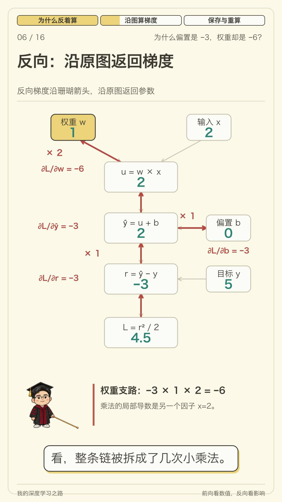

# 反向传播与自动微分 · 程序化解说视频

当前为过程优化版，约 4 分钟。沿同一个手算例子，让数值沿计算图前进、梯度沿原路返回，逐步解释链式法则、参数更新、分支求和、自动微分模式和训练中的存储与重算。讲解使用博士服教棍的透明 PNG 序列帧，保留已验收配音与字幕。

- [带章节与拖动的播放器](backprop-explainer-v2/watch.html)
- [观看或下载最终 MP4](https://qingjian-shikanon-media-sg-2026.oss-ap-southeast-1.aliyuncs.com/my-deep-learning-journey/knowledge-videos/backpropagation/6b8d998cb3835256/backpropagation-v2.mp4) · [对象存储发布记录](publication.json)
- [画面改进记录](backprop-explainer-v2/animation-review.md) · [分镜](backprop-explainer-v2/storyboard.md)
- [制作记录与重建说明](backprop-explainer-v2/production-notes.md)
- [口播脚本](backprop-explainer-v2/narration.json) · [字幕](backprop-explainer-v2/captions.srt)
- [公式、经典论文与近期来源核验](backprop-explainer-v2/research.md)
- [人物帧来源](backprop-explainer-v2/asset-provenance.json) · [声音来源](backprop-explainer-v2/audio-provenance.json) · [最终验收](backprop-explainer-v2/validation.json)



本地成片位于 `backprop-explainer-v2/renders/backpropagation-v2.mp4`。作者参考声音、配音、渲染与详细 QA 保留本地；源码、字幕、分镜和根目录人物序列帧可复用。播放器和下载入口统一使用对象存储中的最终文件。历史 V1 工程已删除，只保留最终 V2 工程。必要音轨、声音来源和语音验收证据已移入 V2，详见 [清理记录](cleanup-projects-report.json)。

成片为 240.213 秒、1080×1920、30 fps，约 12.3 MB，已完成 1×有声连续播放与全片解码验收。`backprop-explainer-v2/renders/backpropagation-optimized-preview.mp4` 为从最终文件截取的 44 秒过程预览。播放器的“放大观看”可铺满当前窗口，按钮或 Esc 可退出。

从仓库根目录启动播放器：

```bash
python3 03-deep-learning/backpropagation/video/backprop-explainer-v2/serve_player.py --background
```

默认地址为 `http://127.0.0.1:8773/03-deep-learning/backpropagation/video/backprop-explainer-v2/watch.html`，也可直接打开 `watch.html`。播放器支持章节按钮、拖动、空格播放/暂停、左右键跳 5 秒、Home / End 跳首尾。完整复现需要保留本工程的本地音轨与仓库根目录人物资产，详见制作记录。
