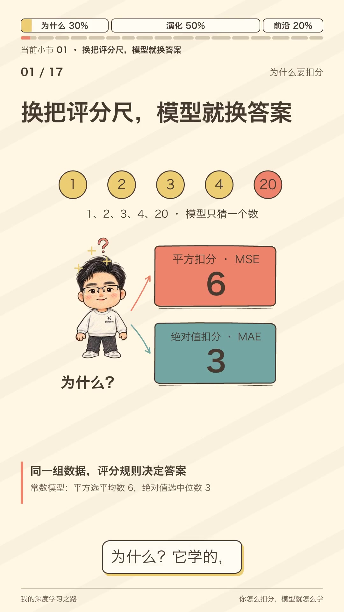
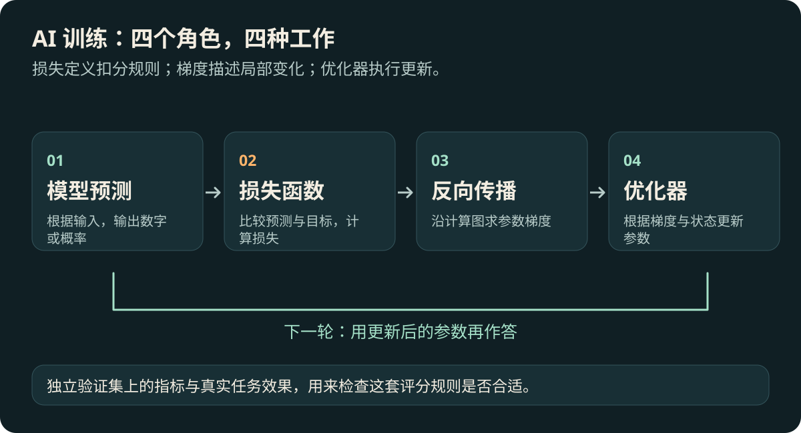
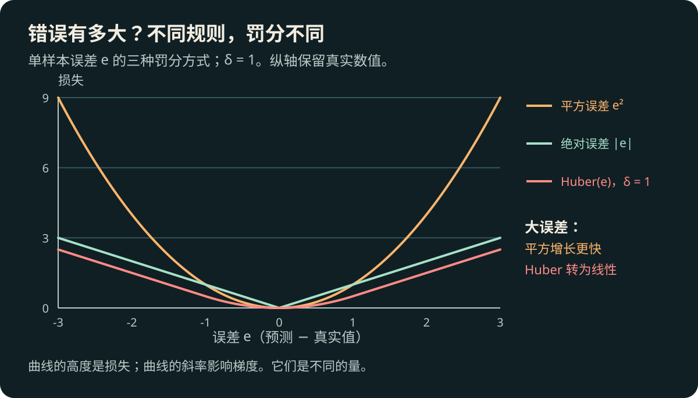
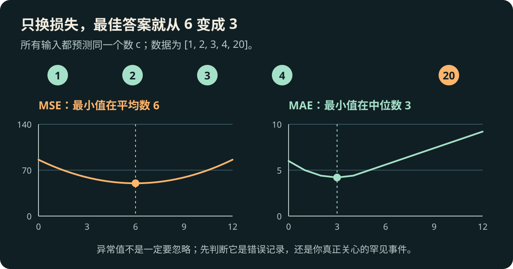
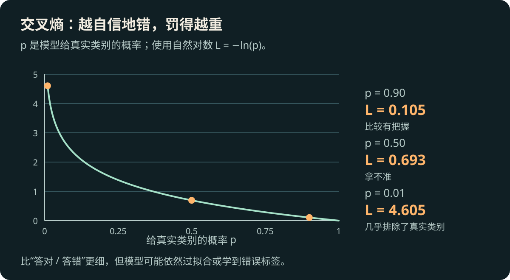
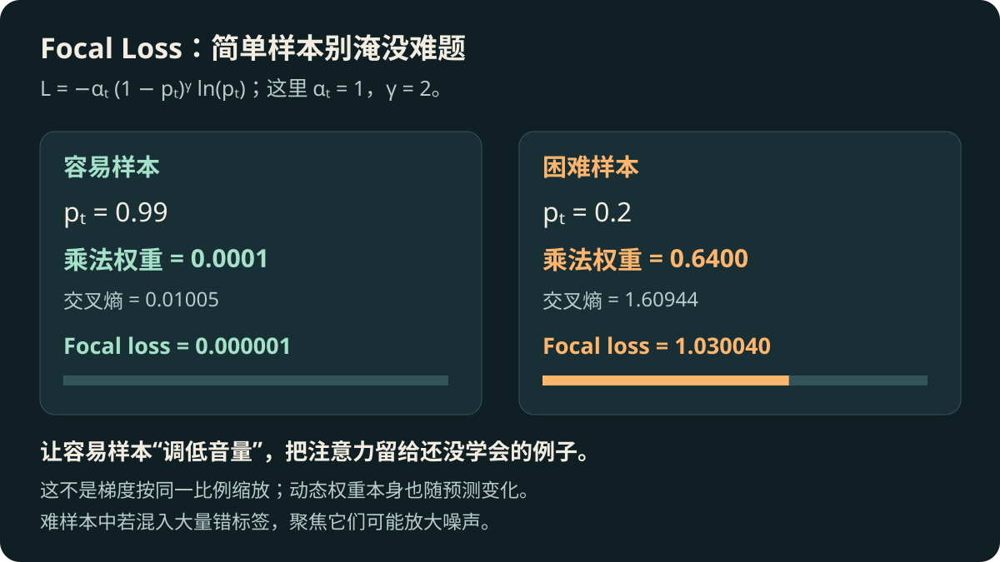
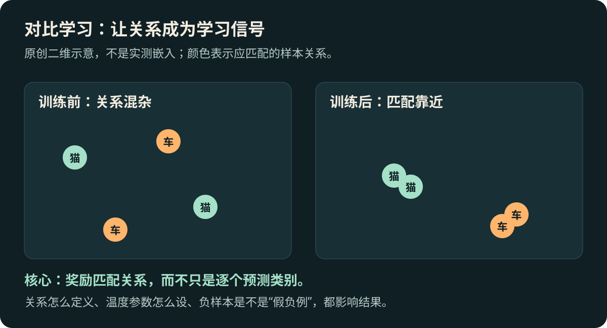
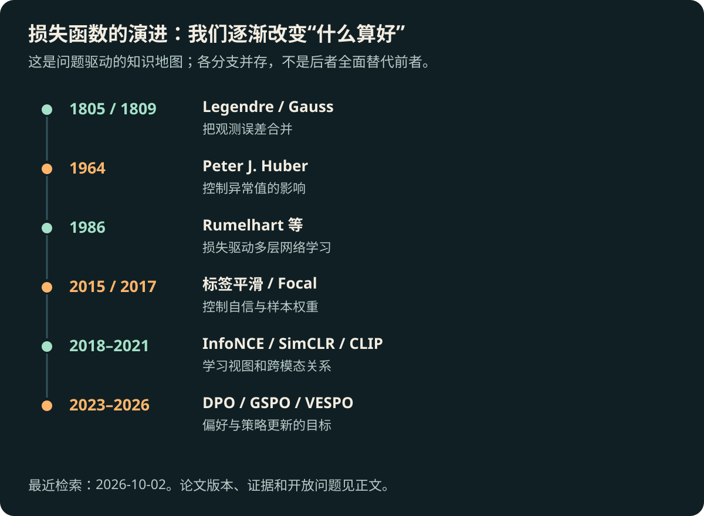

# 损失函数：你怎么扣分，AI 就怎么学

[返回知识点索引](README.md) · [返回总索引](../../README.md)

> 同一批数据、同一个模型，只换扣分规则，最好的答案就可能改变。
>
> 本文按“为什么需要它 → 规则怎样演化 → 今天还在研究什么”展开，主线篇幅约按 **30% / 50% / 20%** 分配。可以独立阅读；动画、配音、分镜和播放器统一放在 [video 文件夹](video/README.md)。

## 配套解说视频

[](https://qingjian-shikanon-media-sg-2026.oss-ap-southeast-1.aliyuncs.com/my-deep-learning-journey/knowledge-videos/loss-functions/d443e69387d815f7/loss-functions-v6.mp4)

[观看或下载最终视频 · 2 分 59 秒](https://qingjian-shikanon-media-sg-2026.oss-ap-southeast-1.aliyuncs.com/my-deep-learning-journey/knowledge-videos/loss-functions/d443e69387d815f7/loss-functions-v6.mp4) · [章节播放器与制作工程](video/README.md) · [可复用制作 Skill](../../knowledge-video-production/SKILL.md)

视频采用作者手绘形象与参考音色，闭嘴微笑，配合手势、点头、脚步和教棍讲解。点击封面即可打开公开 MP4；正文可独立阅读。

<!-- allocation:why:start -->
## 一句话认识这个概念

**损失函数是一把评分尺：把预测与目标之间的差异，变成可以比较、可以改进的代价。**

让机器人猜温度，它说二十一度，实际是二十度。“错了”只能告诉它结果不对，不能说明这次和猜成四十度有什么区别。损失函数补上这一步：错得多严重，要扣几分。

这把尺还包含取舍。错过一次重要警报，可能比多报一次更严重；预测普通日子的误差，也可能比预测极端天气的误差更不值得担心。模型不知道这些轻重，你得在训练目标和评估中明确表达。

## 为什么被提出，要解决什么问题

### 问题一：多个观测不一致，哪个解释最好？

损失的故事并不是从神经网络开始的。测量天体位置时，不同观察者会给出不同结果。测量含有噪声，理论也有待校准，人们需要从一组不完全一致的数里寻找合理解释。

一个看似简单的办法，是把预测误差直接相加。但多报三、少报三，相加等于零；这只是互相抵消，并不意味着测准了。如果拿这样的规则选模型，它甚至可能靠“错得正负相等”得到满分。

最小二乘法先平方，再相加：两次误差各贡献九，总代价十八。它把模糊的“拟合得好不好”变成了可优化的问题。勒让德在 **1805 年公开发表**这一方法；高斯在 **1809 年著作**中将其与误差的概率模型联系起来。见 [Legendre 原著](https://www.e-rara.ch/zut/content/titleinfo/10838079) 和 [Gauss 原著](https://doi.org/10.3931/e-rara-522)。

这里没有一个能包办整个概念的发明者。平方误差、概率评分、统计决策和机器学习目标来自不同问题，后来逐渐形成了今天的损失函数工具箱。

### 问题二：只看对错，模型拿不到细致反馈

真实答案是猫，两台模型却都选了狗：

| 模型 | 给猫的概率 | 给狗的概率 | 准确率看到的结果 |
| --- | ---: | ---: | --- |
| A | 49% | 51% | 错 |
| B | 1% | 99% | 错 |

A 只是稍微摇摆，B 几乎排除了正确答案。准确率把二者压成同一个“错”。训练时，参数小幅变化只要没有跨过分类边界，准确率就可能完全不变；模型不知道调整是否在靠近正确答案。

概率损失提供更连续的反馈。把给猫的概率从百分之一提高到百分之二，虽然最终仍选狗，评分已经可以改善。我们常用这种**代理目标**帮助学习，再用准确率、召回率等任务指标检验结果。代理目标更方便优化，却不一定与真实需求完全一致。

### 问题三：说清“方向”，还得分清谁负责什么



*图 1：评分、求导、更新是三个不同职责。原创示意。*

损失给出当前代价；[反向传播](../backpropagation/README.md)计算参数变化会怎样影响这个代价；[优化器](../optimizers/README.md)根据梯度和历史信息更新参数。你可以理解为：先评分，再找改善方向，最后迈出一步。

曲线高度表示损失，斜率影响梯度。**损失值更大，不等于参数更新一定更大。** 学习率、模型结构、链式求导和优化器都参与决定实际变化。也不是所有损失都必须处处可微，绝对误差在零点可以用次梯度处理。

## 前置知识与关联概念

先会平均数、绝对值、平方和概率即可。导数暂时理解为“这里的评分对变化有多敏感”。概率视角可继续看 [最大似然与贝叶斯学习](../../02-machine-learning/likelihood-and-bayes/README.md)；独立检验可看 [评估指标](../../02-machine-learning/metrics/README.md)。

常见目标为 $J(\theta)=\frac1N\sum_i\ell(f_\theta(x_i),y_i)+\lambda R(\theta)$。$\ell$ 给单个样本评分，$N$ 是样本数，$\theta$ 是参数，$R$ 是正则项，$\lambda$ 决定约束强度。读代码时要确认求和还是平均，以及哪些样本或位置被屏蔽。
<!-- allocation:why:end -->

<!-- allocation:evolution:start -->
## 直觉、图解与核心原理

### 第一站：大错误应该得到多大的关注？

设误差 $e=\hat y-y$。**均方误差（MSE）**平均 $e^2$，**平均绝对误差（MAE）**平均 $|e|$：

$$
L_{\rm MSE}=\frac1N\sum_i e_i^2,\qquad L_{\rm MAE}=\frac1N\sum_i |e_i|.
$$

误差从一到三，平方规则的扣分从一跳到九，绝对值规则只从一到三。前者更强烈地追赶大偏差。



*图 2：同一坐标下的单样本损失，没有分别归一化。*

同样预测 `[1, 2, 3, 4, 20]`，模型只能输出一个常数：MSE 选择**平均数六**，MAE 选择**中位数三**。

| 预测常数 | MSE | MAE |
| --- | ---: | ---: |
| 3 | 59.0 | **4.2** |
| 6 | **50.0** | 5.6 |



*图 3：分别比较各自最小值；两幅图的纵轴单位不同。数值由文末实验核验。*

如果二十是录入错误，你可能希望降低它的影响；如果二十是真实的重要极端事件，忽略它也有代价。没有一条规则天然最好。固定噪声尺度等条件下，MSE 与高斯噪声、MAE 与拉普拉斯噪声的负对数似然对应：**选规则，也是在选对误差的假设。**

### 第二站：Huber 让大残差别一直加速

**Peter J. Huber 是关键转折。** 他在 [1964 年的稳健位置估计论文](https://doi.org/10.1214/aoms/1177703732)中研究：数据掺入少量污染后，方法还能不能可靠？相关损失为：

$$
\ell_\delta(e)=\begin{cases}\tfrac12 e^2,&|e|\le\delta,\\\delta(|e|-\tfrac12\delta),&|e|>\delta.\end{cases}
$$

小误差仍用平滑的平方，大误差改成直线。像给残差梯度装限速器：超过阈值 $\delta$，导数大小不再增长。它控制的是异常残差的影响，不能自动解决输入高杠杆点等所有异常。阈值还有单位，米改成厘米时也得调整。

[Barron 的通用自适应稳健损失](https://arxiv.org/abs/1701.03077)（2017 年预印本、CVPR 2019）进一步把多种形状放进连续参数族。思想从“手选一种形状”走向“调节甚至学习形状”，仍需要检查概率假设与应用边界。

### 第三站：从数值误差，走到概率评分

交叉熵给类别概率评分。预测分布为 $p$，目标分布为 $q$：

$$
\ell_{\rm CE}=-\sum_{k=1}^K q_k\ln p_k.
$$

硬标签只剩真实类别 $t$ 的 $-\ln p_t$。给正确类别 90%、50%、1% 时，扣分约为 **0.105、0.693、4.605**。



*图 4：“自信地错”在这里指给真实类别极低概率。采用自然对数。*

为什么取负对数？独立样本的最大似然要让真实标签的概率乘积尽可能大；取负对数后变成可相加、要最小化的目标。[Shannon 1948 年的信息论](https://reach.ieee.org/primary-sources/a-mathematical-theory-of-communication/)是熵的重要背景，不能据此说他发明了神经网络交叉熵。

### 第四站：谁应该在训练里“大声说话”？

密集检测有海量容易背景，少量困难目标可能被淹没。[Lin 等的 Focal Loss](https://arxiv.org/abs/1708.02002)（2017）改造了交叉熵：

$$
\ell_{\rm FL}=-\alpha_t(1-p_t)^\gamma\ln p_t.
$$

$\alpha_t$ 调节类别权重，$\gamma$ 控制聚焦。取 $\gamma=2$，容易样本 $p_t=0.99$ 的乘法权重为 0.0001，困难样本 $p_t=0.2$ 的权重为 0.64。像把已经会的题调低音量。



*图 5：这是损失的乘法权重，不能直接当成梯度缩放比例。权重自己也依赖预测。*

难样本也可能是错标签，聚焦更强不保证更好。Focal 这篇论文值得精读，因为它把**失败场景、机制、RetinaNet 系统和消融实验**连成了完整研究链。

这两条路线的差别值得细想。Huber 不希望异常残差控制整体更新，Focal 却希望困难样本获得更多相对关注。一条减少极端值的影响，一条提高难题的相对地位。它们没有矛盾，面对的是不同失败：前者怀疑数据污染，后者担心容易样本数量压倒了学习信号。先检查数据里到底发生了什么，才能决定该限速还是聚焦。

另一条路线是**标签平滑**：改变目标，而非只改样本音量。常用 $q_k=(1-\varepsilon)\mathbf1[k=t]+\varepsilon/K$。三个类别、$\varepsilon=0.1$，目标由 `[1,0,0]` 变成约 `[0.9333,0.0333,0.0333]`。[Inception 论文](https://arxiv.org/abs/1512.00567)（2015 预印本、CVPR 2016）把它用于正则化；[后续研究](https://arxiv.org/abs/1906.02629)说明校准、蒸馏等收益有边界。

### 第五站：从标准答案，走到关系与偏好

图片检索更关心“谁与谁匹配”。对比学习把正样本拉近，负样本推开：

$$
\ell_{\rm InfoNCE}=-\ln\frac{\exp(s(z,z^+)/\tau)}{\exp(s(z,z^+)/\tau)+\sum_j\exp(s(z,z_j^-)/\tau)}.
$$

$z$ 是锚点，$z^+$ 是正样本，$z_j^-$ 是负样本，$s$ 是相似度，$\tau$ 是温度。分子是匹配者，分母是候选集合；公式把“选出匹配者”变成分类。实际采样与双向目标须看各论文。



*图 6：表示空间的二维示意，并非实测结果。*

从 [Hadsell、Chopra、LeCun 的样本对学习（2006）](https://yann.lecun.org/exdb/publis/pdf/hadsell-chopra-lecun-06.pdf)，到 [CPC / InfoNCE（2018）](https://arxiv.org/abs/1807.03748)、[SimCLR（2020）](https://arxiv.org/abs/2002.05709)、[CLIP（2021）](https://arxiv.org/abs/2103.00020)，监督逐渐扩展为视图关系和图文配对。数据增强、采样和规模也推动了进步；假负例可能把本该相近的东西推远。

开放式回答又没有唯一标准答案。[Rafailov 等的 DPO（2023）](https://arxiv.org/abs/2305.18290)使用人们更喜欢的回答 $y_w$ 与较不喜欢的 $y_l$：

$$
\ell_{\rm DPO}=-\ln\sigma\!\left(\beta\left[\ln\frac{\pi_\theta(y_w|x)}{\pi_{\rm ref}(y_w|x)}-\ln\frac{\pi_\theta(y_l|x)}{\pi_{\rm ref}(y_l|x)}\right]\right).
$$

$x$ 是问题，$\pi_\theta$ 是当前模型，$\pi_{\rm ref}$ 是参考模型，$\beta$ 控制相对尺度，$\sigma$ 是 sigmoid。比较的是两条回答**相对参考模型**的概率变化，不能简化成“无限提高好回答的绝对概率”。在特定偏好模型与 KL 正则化设定下，它把目标变成直接优化回答对；偏好噪声仍会影响训练。

## 历史演进



*图 7：旧规则继续使用，新规则针对新的失败模式。*

| 阶段 | 失败模式 → 新思想 | 关键节点 |
| --- | --- | --- |
| 测量时代 | 正负抵消 → 汇总误差代价 | Legendre 1805，Gauss 1809 |
| 稳健统计 | 污染数据牵着结果走 → 控制残差影响 | Huber 1964 |
| 网络学习 | 内部参数难调整 → 误差回传 | [Rumelhart、Hinton、Williams 1986](https://doi.org/10.1038/323533a0)，代表性推广节点 |
| 分类与检测 | 过度自信、容易样本淹没目标 → 改目标与权重 | 标签平滑、Focal Loss |
| 表示与生成 | 标准标签不足 → 关系和回答偏好 | InfoNCE、CLIP、DPO |

## 关键人物与论文

重点认识 Huber 的问题意识：漂亮的误差假设受到污染，方法如何仍然可信。再读 Focal 的研究链，体会论文为何不止给出公式。DPO 则说明监督形式改变时，目标本身也可以重新推导。

一个模型同时做分类和测深度，还会遇到“两个评分表怎样合并”的问题。常见写法是 $J=\lambda_1L_1+\lambda_2L_2$，但原始数值大不表示任务更重要。单位、求平均方式和梯度方向都会影响贡献。看似简单的权重，实际是在决定训练资源朝哪里分配；因此必须分别检查每项任务的表现。

还可以读 [Kendall、Gal、Cipolla](https://arxiv.org/abs/1705.07115)（2017 公开、CVPR 2018）的多任务权重研究：分类和深度目标的单位不同，直接相加未必合理。他们由同方差不确定性推导权重；这不是“任务越难越重要”，也不自动解决梯度冲突。
<!-- allocation:evolution:end -->

<!-- allocation:frontier:start -->
## 近期研究与开放问题

**检索截至 2026-10-02。** 以下按思想选代表，先看修复的失败与比较是否公平。

### 方向一：一套表示，同时学会全局和局部

[SigLIP 2（Tschannen 等，2025-02-20，本文读 v1）](https://arxiv.org/html/2502.14786v1)的有趣之处，是组合不同目标。图文匹配用 sigmoid 配对评分，解码器学习描述与定位；训练后期加入局部到全局的自蒸馏和掩码预测。整张图像“是一只猫”，还不等于能指出猫在哪里，多个目标补充不同能力。

已阅读 §2.2–2.3。数据、分辨率、模型与训练配方也变化，不能把全部提升归给一个公式。可关注它的训练阶段、各目标权重与局部特征评估。

### 方向二：更新单位从词，走向整段回答

长回答里，每个词各自评分、每条回答平均评分，可能给长短答案不同的贡献。旧策略生成的数据用于更新新策略，还会出现重要性权重不稳定的问题。

| 论文与版本 | 核心问题 / 思想 | 本文阅读范围 |
| --- | --- | --- |
| [DAPO，Yu 等](https://arxiv.org/abs/2503.14476)：2025-03-18；v2 / 2025-05-20 | 裁剪、token 聚合与动态采样共同改善推理强化学习 | 摘要与版本，未复现 |
| [Dr. GRPO，Liu 等](https://arxiv.org/abs/2503.20783)：2025-03-26；v2 / 2025-10-06 | 检查归一化引入的长度等优化偏差 | 摘要与版本，未复现 |
| [GSPO，Zheng 等](https://arxiv.org/html/2507.18071v2)：2025-07-24；v2 / 2025-07-28 | 把重要性比率、裁剪移到序列层面 | 动机与目标 |
| [VESPO，Shen 等](https://arxiv.org/html/2602.10693v3)：2026-02-11；v3 / 2026-05-08 | 从变分目标推导序列权重的软重塑，处理旧策略数据与方差 | §3–4 及实验设置 |

值得对照的不是谁名字更新，而是：怎样归一化、怎样控制极端权重、稳定性是否牺牲偏差。论文设置中的稳定改善，不代表全部模型和奖励都受益，也不等于真实推理能力必然变强。

### 方向三：别只盯着训练分数

非常新的 [CGCL（Ahmed 等，2026-09-18，v1）](https://arxiv.org/html/2609.21599v1)把加权交叉熵与质心推拉目标组合，用于招聘诈骗检测。它尝试同时改善分类与表示结构，呼应对比学习这条主线。已核验摘要、算法和实验结构；目前为投稿预印本，主要在 EMSCAD 验证，泛化与数据划分仍待检查。

三个可以带着读论文的问题：**难样本怎样与错标签区分？整段任务成功能否被局部评分代表？更低 loss 有没有带来独立指标的改善？** 这些问题比收集一串新公式更能帮助判断研究价值。

## 从入门到前沿的扩展阅读

先运行本文实验，再读 Huber 的污染模型、Focal §3 与消融，随后看 CPC §2.3、CLIP Figure 1、DPO §3–4。近期重点读 SigLIP 2 §2，比较 GSPO 与 VESPO 的更新单位和权重。

跟进这些作者的 arXiv 修订，以及 CVPR、ICLR、NeurIPS、ICML 的相关论文。每次记四件事：**修复哪种失败、改了什么、和谁比较、哪些条件下有效。** 阅读范围见上文，未独立复现。
<!-- allocation:frontier:end -->

## 最小例子与实践

[标准库实验](examples/loss_lab.py)已执行，[结果](examples/results.json)核验 MSE 最优六、MAE 最优三及上述概率数值。[绘图脚本](examples/make_figures.py)从公式生成原创 SVG。

```bash
python3 03-deep-learning/loss-functions/examples/loss_lab.py
python3 03-deep-learning/loss-functions/examples/make_figures.py
```

这是固定输出的教学实验，不是网络性能比较。工程实现可核对 [PyTorch CrossEntropyLoss](https://docs.pytorch.org/docs/stable/generated/torch.nn.CrossEntropyLoss.html) 和 [HuberLoss](https://docs.pytorch.org/docs/stable/generated/torch.nn.HuberLoss.html)：logits、平均方式、类别权重、阈值与缩放都可能改变实际目标。

## 常见误区与适用边界

更低训练损失不保证泛化更好；不同损失的数值也不能直接横比。多标签与互斥多分类不是同一目标。Huber 的“限速”和 Focal 的“聚焦”针对不同困难。选损失后，仍要用独立数据和任务指标评估。

## 核心问题与结论

选损失是在规定什么错误更重要、哪些样本更值得关注、什么关系更值得学习。先把问题讲清，再选公式，最后检验目标是否代表真实需要。

## 自测与复习

1. 为什么多报三与少报三不能当作没有误差？
2. 同一组 `[1,2,3,4,20]`，两种损失为何选择六和三？
3. Huber 限制什么，Focal 降低谁的影响？
4. DPO 为何要比较参考模型？
5. 新论文同时改了数据与训练目标，能否把全部收益归给 loss？

提示：依次想到抵消、均值与中位数、残差导数与容易样本、相对概率、对照与消融。
