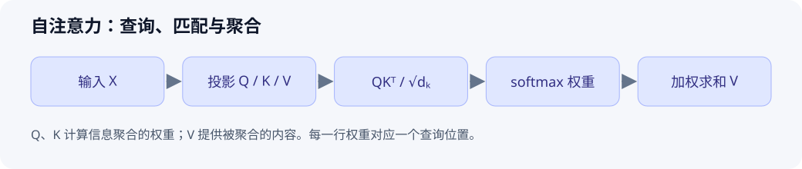

# 自注意力与 QKV

> 初始示范：原理与手算示例已整理；个人实验和复习待完成。

[返回主题索引](README.md) · [返回首页](../README.md)


## 核心问题与结论

一个 token 如何利用其他 token 的信息？自注意力让每个位置生成查询（Q），用它与各位置的键（K）计算权重，再对值（V）加权求和。Q、K、V 来自同一个输入序列的不同投影。

## 前置知识

矩阵乘法、向量点积、softmax、Embedding。[反向传播](../03-deep-learning/001-backpropagation.md)解释这些投影参数如何学习。

## 原理与推导

设输入 $X\in\mathbb{R}^{n\times d_{model}}$，则 $Q=XW_Q$、$K=XW_K$、$V=XW_V$。单头缩放点积注意力为：

$$
\operatorname{Attention}(Q,K,V)
=\operatorname{softmax}\left(\frac{QK^T}{\sqrt{d_k}}+M\right)V.
$$

$n$ 是序列长度，$d_k$ 是 Q/K 的维度，$M$ 是可选 mask。softmax 沿键的位置归一化，所以权重矩阵是 $n\times n$，每行对应一个查询位置。自回归生成中，未来位置通过因果 mask 被屏蔽。

缩放项控制点积分数的量级，降低高维点积把 softmax 推向饱和区的风险。位置关系还需要位置编码或位置相关机制表达。

## 图解



图注：原创示意。Q 与 K 决定“从哪里取信息”，V 提供实际被聚合的信息；图中省略 mask 和多头拼接。

## 最小例子与实践

为单个查询取 $q=[1,0]$，两个键为 $k_1=[1,0],k_2=[0,1]$，两个值为 $v_1=[10,0],v_2=[0,10]$。缩放分数是 $[1/\sqrt2,0]$，归一化权重约为 $[0.670,0.330]$，输出约为 $[6.70,3.30]$。这些数值为手算近似。

```python
import math
scores = [1 / math.sqrt(2), 0.0]
shift = max(scores)
exps = [math.exp(s - shift) for s in scores]
weights = [e / sum(exps) for e in exps]
values = [[10.0, 0.0], [0.0, 10.0]]
out = [sum(weights[i] * values[i][j] for i in range(2)) for j in range(2)]
print(weights, out)
```

- 环境：Python 3，无第三方依赖、无随机性。
- 个人实测：待执行。
- 扩展练习：把第二个键屏蔽，验证权重变成 `[1, 0]`；画出 3 个 token 的下三角因果 mask。

## 常见误区与适用边界

| 误区 | 正确理解 |
| --- | --- |
| Q、K、V 是三段不同文本 | 自注意力中它们通常由同一输入的不同投影得到 |
| Attention 权重就是因果解释 | 权重说明聚合比例，不能单独证明模型行为的因果来源 |
| 每个 token 都能看到未来 | 自回归模型训练和生成依赖因果屏蔽 |

## 论文与扩展阅读

| 来源 | 年份 | 阅读位置与目的 | 阅读状态 / 访问核验 |
| --- | --- | --- | --- |
| [Attention Is All You Need](https://arxiv.org/abs/1706.03762) | 2017 | §3.2.1、§3.2.2，缩放点积与多头注意力；对照 Fig. 2 | 待读 / 页面及 HTML 原文已核验 |

参考链接核验日期：2026-10-01。以上机制整理对应原文 §3.2；手算例子为原创。

## 个人归纳与待解问题

- 待补充：用自己的话解释为什么 K 与 V 要分成两个投影。
- 下一篇：多头机制、位置编码与 KV Cache。

## 自测与复习

- [ ] 写出 Q、K、V 和权重矩阵的维度。
- [ ] 解释 softmax 应沿哪一维计算。
- [ ] 手画因果 mask，说明训练时为什么不能看到未来 token。
- 下次复习：个人学习后填写。
