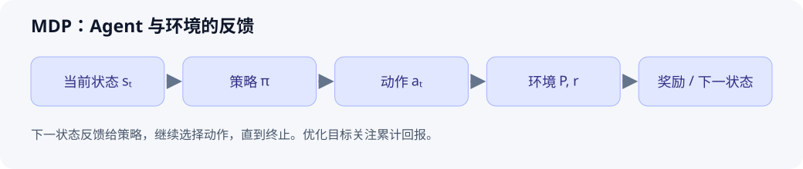

# MDP、状态与动作

> 初始示范：原理与手算示例已整理；个人实验和复习待完成。

[返回主题索引](README.md) · [返回首页](../README.md)


## 核心问题与结论

如何描述动作会影响后续状态与奖励的任务？马尔可夫决策过程（MDP）把它表示为状态、动作、转移、奖励与折扣。策略决定在状态下如何选择动作，目标通常是最大化期望累计回报。

## 前置知识

条件概率、期望、随机变量。区分任务的完整状态和 Agent 实际能看到的观测。

## 原理与推导

采用五元组 $\mathcal M=(\mathcal S,\mathcal A,P,r,\gamma)$：$P(s'\mid s,a)$ 是转移概率，$r(s,a,s')$ 是该转移的期望即时奖励，$\gamma$ 是折扣因子。策略写作 $\pi(a\mid s)$。

马尔可夫假设是：给定当前状态和动作后，下一状态的分布不再依赖更早的历史。若观测不足以表示状态，问题可能需要按 POMDP 处理或加入历史信息。

定义回报 $G_t=\sum_{k\ge0}\gamma^kR_{t+k+1}$，状态价值为 $V^\pi(s)=\mathbb E_\pi[G_t\mid S_t=s]$。Bellman 期望方程是：

$$
V^\pi(s)=\sum_a\pi(a\mid s)\sum_{s'}P(s'\mid s,a)
\left[r(s,a,s')+\gamma V^\pi(s')\right].
$$

下面采用有限回合、终止状态价值为 0 的约定。一般无限时域问题常取 $0\le\gamma<1$，还需要奖励有界等条件确保回报良好定义。

## 图解



图注：原创示意。在完整可观测设定下，Agent 根据状态选择动作，环境返回奖励和下一状态，形成序列决策循环。

## 最小例子与实践

考虑两条确定性路径：

| 起点动作 | 第一步奖励 | 第二步奖励 | 第二步后 |
| --- | --- | --- | --- |
| A | 0 | 10 | 终止 |
| B | 3 | 0 | 终止 |

取 $\gamma=0.9$，A 的回报为 9，B 为 3；取 $\gamma=0.2$，A 为 2，B 为 3。折扣会改变即时收益和延迟收益的相对价值。该表是原创玩具任务，数值为手算结果。

```python
for gamma in [0.9, 0.2]:
    returns = {'A': 0 + gamma * 10, 'B': 3 + gamma * 0}
    print(gamma, returns, max(returns, key=returns.get))
```

- 环境：Python 3，无第三方依赖、无随机性。
- 个人实测：待执行。
- 扩展练习：把 A 的第二步成功概率改为 0.5，重新计算期望回报；说明失败分支与终止条件。

## 常见误区与适用边界

| 误区 | 正确理解 |
| --- | --- |
| RL 就是选择即时奖励最高的动作 | 动作影响未来状态，需要比较累计回报 |
| 把所有历史删掉就满足马尔可夫性 | 当前状态必须含有预测后续所需的信息 |
| 奖励和价值是一回事 | 奖励描述一次反馈，价值描述策略下的未来回报 |

## 论文与扩展阅读

| 来源 | 年份 | 阅读位置与目的 | 阅读状态 / 访问核验 |
| --- | --- | --- | --- |
| [Reinforcement Learning: An Introduction](https://incompleteideas.net/book/the-book-2nd.html) | 2018（第 2 版） | 第 3 章 MDP，第 4 章动态规划 | 待读 / 本次访问超时，待复核 |
| [Stanford CS234](https://web.stanford.edu/class/cs234/) | 持续更新 | MDP、策略与价值函数相关讲义 | 待读 / 课程页已核验 |
| [Proximal Policy Optimization Algorithms](https://arxiv.org/abs/1707.06347) | 2017 | 后续进阶，观察策略优化如何建立在累计回报之上 | 待读 / 页面已核验 |

参考链接核验日期：2026-10-01。PPO 属于扩展阅读，先掌握 Bellman 方程和策略梯度再读其目标函数。

## 个人归纳与待解问题

- 待补充：选择一个实际任务，明确状态、动作、奖励与终止条件。
- 关联：[ReAct](../07-agents/001-react.md)也有环境反馈循环，但该循环本身不等于执行 RL 训练。

## 自测与复习

- [ ] 举一个观测不满足马尔可夫性的例子。
- [ ] 计算不同折扣和成功概率下的最优动作。
- [ ] 解释 Bellman 方程中的策略期望和环境转移期望。
- 下次复习：个人学习后填写。
