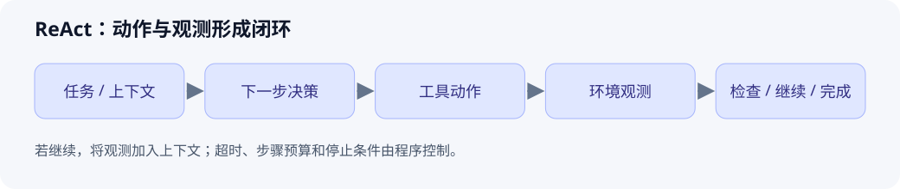

# ReAct 与工具调用循环

> 初始示范：原理与手算示例已整理；个人实验和复习待完成。

[返回主题索引](README.md) · [返回首页](../README.md)


## 核心问题与结论

语言模型如何利用外部证据推进任务？ReAct 在推理、动作和观测之间交替，让动作得到的环境反馈影响后续判断。原论文考察了这种交替方式在问答和交互任务中的效果。

## 前置知识

语言模型生成、工具调用、结构化参数、上下文。可对照 [MDP](../06-reinforcement-learning/001-mdp.md)理解环境反馈，但工具循环本身不意味着模型经过强化学习训练。

## 原理与机制

把一次运行表示为任务、上下文、动作与观测的序列。模型提出下一步动作，程序执行工具并返回结果，模型利用结果决定继续、重试或结束。论文中的 Thought / Action / Observation 是描述这种交替轨迹的方式。

工程实现可以只保存简短行动依据、结构化工具调用和可核对的结果。工具的返回内容是外部数据，需要由程序判断错误与权限，不能自动成为新的系统指令。

## 图解



图注：原创示意。每轮先检查完成条件或预算，再调用工具；观测返回上下文，形成闭环。

## 最小例子与实践

玩具任务：验证“17 × 23 是否大于 400”，只允许使用一个整数乘法工具。

| 步骤 | 示例轨迹 | 核对点 |
| --- | --- | --- |
| 任务 | 比较乘积与 400 | 问题明确 |
| 动作 | `multiply(a=17, b=23)` | 工具与参数有效 |
| 观测 | `391` | 来源是工具执行结果 |
| 完成 | 391 < 400，所以不大于 400 | 回答与观测一致 |

上表是原创流程示例，不是实际模型运行记录。手算结果为 391。

```python
# 控制循环伪代码；需自行接入模型和工具后执行。
context = [task]
for step in range(max_steps):
    decision = model.decide(context)
    if decision.is_final:
        return validate_answer(decision, context)
    call = validate_tool_and_args(decision.tool_call)
    observation = run_tool_with_timeout(call)
    context.extend([call, observation])
return incomplete_result('step budget exhausted', context)
```

- 个人实践：待执行，尚未接入模型。
- 验证设计：记录工具名、参数、返回值、轮数和终止原因。
- 失败测试：工具超时、参数非法、重复动作、预算耗尽；失败时输出未完成状态。

## 常见误区与适用边界

| 误区 | 正确理解 |
| --- | --- |
| 生成一段计划就等于完成任务 | 需要实际执行动作，并检查环境返回的证据 |
| 多调用几轮总会更好 | 每轮有成本；需要停止条件、超时和重试上限 |
| 检索结果可以直接控制工具权限 | 返回文本是数据，工具授权与参数校验由控制层负责 |

## 论文与扩展阅读

| 来源 | 年份 | 阅读位置与目的 | 阅读状态 / 访问核验 |
| --- | --- | --- | --- |
| [ReAct: Synergizing Reasoning and Acting in Language Models](https://arxiv.org/abs/2210.03629) | 2022（首次公开） | 方法与任务轨迹，理解交替机制 | 待读 / 页面已核验 |
| [ReAct 作者项目页](https://react-lm.github.io/) | 持续更新 | 演示与代码入口 | 待读 / 页面已核验 |
| [Retrieval-Augmented Generation for Knowledge-Intensive NLP Tasks](https://arxiv.org/abs/2005.11401) | 2020 | 对照检索增强生成与通用工具循环 | 待读 / 页面已核验 |
| [Toolformer](https://arxiv.org/abs/2302.04761) | 2023 | 对照学习工具调用与推理时的循环控制 | 待读 / 页面已核验 |

参考链接核验日期：2026-10-01。程序控制建议与玩具例子是学习用工程归纳，需在个人实验中验证。

## 个人归纳与待解问题

- 待补充：选一个两步工具任务，并为每步定义成功证据。
- 下一篇：工具参数校验、RAG 或 Agent 评估。

## 自测与复习

- [ ] 区分“提出动作”“动作已执行”“目标已完成”。
- [ ] 为工具超时和预算耗尽设计返回状态。
- [ ] 解释什么时候固定 Workflow 比开放循环更容易验证。
- 下次复习：个人学习后填写。
