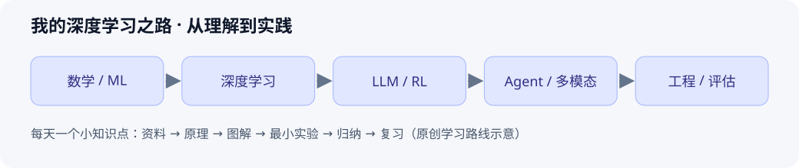

# 我的深度学习之路

记录我学习 **深度学习、大语言模型、强化学习（RL）和 Agent** 的过程。

每天聚焦一个小知识点：搜集一手资料 → 理解原理 → 画图与推导 → 做一个小实验 → 归纳成一篇 Markdown 笔记 → 复习与扩展阅读。



## 知识目录

| 目录 | 大知识点 | 学习重点 |
| --- | --- | --- |
| [00-learning-roadmap](00-learning-roadmap/README.md) | 学习路线与方法 | 路线、每日流程、复习 |
| [01-math-foundations](01-math-foundations/README.md) | 数学基础 | 建立理解模型与算法所需的数学直觉。 |
| [02-machine-learning](02-machine-learning/README.md) | 机器学习 | 理解从数据、目标函数到泛化评估的完整流程。 |
| [03-deep-learning](03-deep-learning/README.md) | 深度学习 | 从计算图出发，理解神经网络的训练机制。 |
| [04-large-language-models](04-large-language-models/README.md) | 大语言模型 | 理解语言模型的结构、训练目标和生成过程。 |
| [05-post-training-and-alignment](05-post-training-and-alignment/README.md) | 后训练与对齐 | 连接模型能力、指令遵循和偏好优化。 |
| [06-reinforcement-learning](06-reinforcement-learning/README.md) | 强化学习 | 从序列决策问题走向策略学习。 |
| [07-agents](07-agents/README.md) | Agent | 理解语言模型如何通过工具和环境反馈完成任务。 |
| [08-multimodal-and-generative-models](08-multimodal-and-generative-models/README.md) | 多模态与生成模型 | 连接图像、音频、视频和语言的表示与生成。 |
| [09-training-and-inference-engineering](09-training-and-inference-engineering/README.md) | 训练与推理工程 | 用可复现的工程实践验证理论。 |
| [10-evaluation-and-research](10-evaluation-and-research/README.md) | 评估与研究方法 | 建立阅读论文、设计实验和判断结论的习惯。 |

## 从这里开始

1. 查看[学习路线](00-learning-roadmap/README.md)，选择一个主题。
2. 打开主题目录的 `README.md`，挑一个待学习知识点。
3. 复制[知识点笔记模板](templates/knowledge-note.md)，或使用下方命令创建笔记。
4. 填写原理、图解、关键公式、实践记录、常见误区与论文扩展阅读。
5. 把笔记链接加入主题索引，在[学习日志](journal/README.md)记录当天的真实收获。

```bash
# 在仓库根目录运行；需要 Python 3.9+，不需要第三方依赖。
python3 scripts/new_note.py 04-large-language-models 002-tokenization Tokenization与词表
python3 scripts/check_notes.py
```

## 示范笔记

初始示范用于展示写作方式，状态为 `draft`，个人实践待完成。

| 主题 | 笔记 |
| --- | --- |
| 深度学习 | [反向传播与自动微分](03-deep-learning/001-backpropagation.md) |
| 大语言模型 | [自注意力与 QKV](04-large-language-models/001-self-attention.md) |
| 强化学习 | [MDP、状态与动作](06-reinforcement-learning/001-mdp.md) |
| Agent | [ReAct 与工具调用循环](07-agents/001-react.md) |

## 写作约定

- 一个大知识点一个目录，一个小知识点一篇 Markdown；文件名为 `序号-英文主题.md`，文档标题使用中文。
- 每个主题的 `README.md` 是索引；跨主题知识用相对链接互相引用，避免重复维护。
- 每篇笔记至少有一张能解释机制的图，优先使用 Mermaid 或自己绘制的 SVG；图片放在主题的 `assets/` 下。
- 区分资料结论、自己的理解和实际实验结果；实践没有执行时写明“待执行”。
- 状态使用 `draft`（草稿）、`learning`（学习中）、`review`（待复习）、`done`（已归纳并完成自测）。
- 引用优先采用论文原文、作者主页和官方文档；注明年份、对应章节、阅读目的及访问核验情况。
- 复用他人图片时保留来源和授权说明；学习资料以链接引用，原创图需标注。

更多约定见 [CONTRIBUTING.md](CONTRIBUTING.md)。[论文与资料库](resources/README.md)用于统一追踪扩展阅读。
