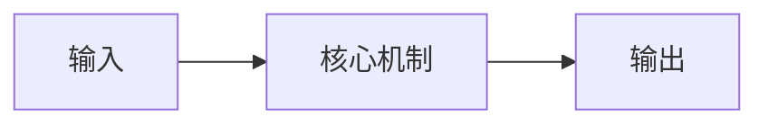

# {{title}}

[返回主题索引](README.md) · [返回首页](../README.md)

## 核心问题与结论

> 今天要回答的问题：TODO

用 3–5 句话说明定义、用途和成立条件。

## 前置知识

- TODO：链接到相关笔记，列出必须理解的概念。

## 原理与推导

先建立直觉，再给出定义或公式。说明所有符号的含义、维度与假设，并把资料结论和个人推断分开写。

## 图解

图注：TODO（替换为解释当前知识点的图）。该模板图为原创示意。
本地图像写法见写作约定；引用图片时注明来源和授权。

## 最小例子与实践

- 目标：TODO
- 环境与版本：TODO
- 输入与参数：TODO
- 代码或实验步骤：TODO
- 预期结果：TODO
- 实测结果：待执行
- 解释与局限：TODO

## 常见误区与适用边界

| 误区 | 正确理解或反例 |
| --- | --- |
| TODO | TODO |

## 论文与扩展阅读

| 来源 | 年份 | 阅读位置 | 为什么读 | 阅读状态 / 访问核验 |
| --- | --- | --- | --- | --- |
| TODO：论文原文或官方链接 | TODO | 章节 / 图表 | 与本知识点的关系 | 待读 / 待核验 |

## 个人归纳与待解问题

- 我的理解：TODO
- 尚未理解：TODO
- 与其他知识点的联系：TODO

## 自测与复习

- [ ] 不看资料解释核心机制。
- [ ] 完成最小例子并解释结果。
- [ ] 回答问题 1：TODO
- [ ] 回答问题 2：TODO
- 下次复习：TODO
